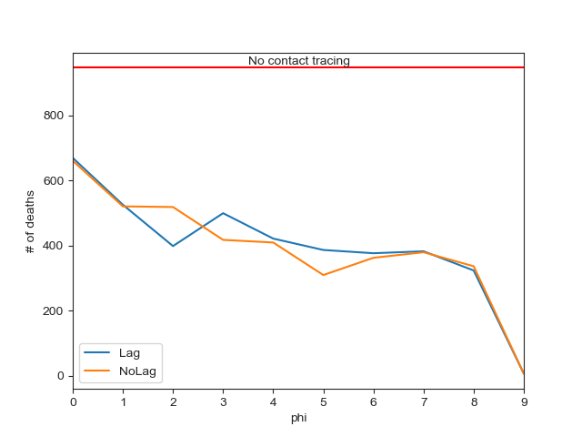
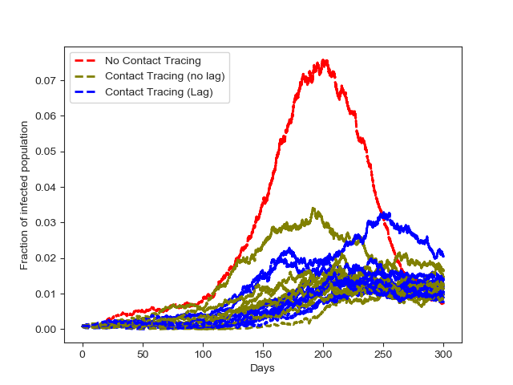
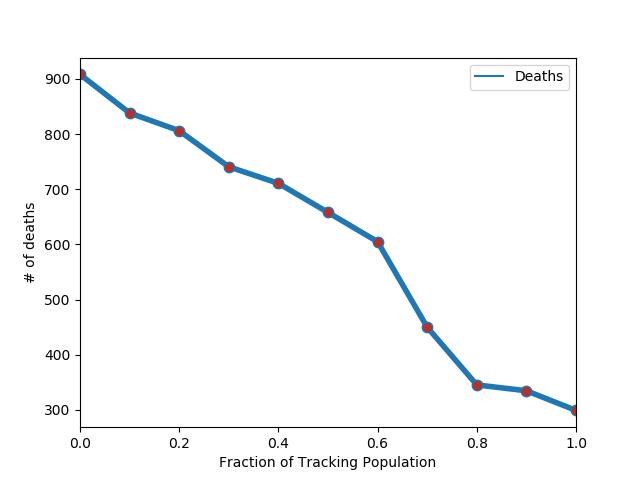
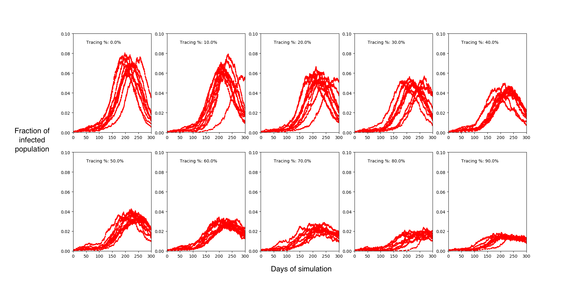

# The Importance of Contact Tracing

Singapore rolled out a full blown <a href="https://www.zdnet.com/article/singapore-introduces-contact-tracing-app-to-slow-coronavirus-spread/">digital contact tracing app</a> to help with identifyig early cases of COVID-19 based on who has been in close proximity with whom. We can estimate the impact of this using the SEIRS+ simulator. 

## No contact tracing

We start by examining the case of no contact tracing. In particular, we build a small population of 10,000 people, say from Covidburgh, and we generate a contact network. While the structure of this model can be obtained from real mobility data, we generate a scale free network. We also randomly sample this structure to define the distancing and quarantine networks. We set the simulation time to be 300 days and we start social distancing 20 days after the epidemic starts, with an 80 days duration. The following are the parameters we used: 

```model = SEIRSNetworkModel(G=G_normal,beta=0.155, sigma=1/5.2,gamma=1/16.39,mu_I=0.01,p=0.5, Q=G_quarantine,beta_D=0.155, sigma_D=1/5.2, gamma_D=1/12.39, mu_D=0.01, theta_E=0,theta_I=0.02,psi_E=1.0, psi_I=1.0, q=0.5, initI = 10)```

As we can see we also assume that there are no tests happening to exposed individuals (```theta_E```), since currently there are no tests administered to asymptomatic individuals. 

## Contact tracing 

For the case of contact tracing we examine two high-level cases; (i) contact tracing starts immediately when the epidemic starts (no lag), (ii) contact tracing starts when the social distancing measures are put in place (lag). No for each one of these cases, we consider different levels of contact tracing (aggressiveness), which can be controled through the parameters ```phi_E``` and ```phi_I```. We set both of these parameters to be equal in each simulation as we want to simulate the same level of aggressiveness for both exposed and infected individuals. This level of agressiveness can be also thought of as to how fast the tracing system in place can identify and quarantine people (larger values of ```phi_*``` correspond to faster tracing - e.g., digital tracing). 

We have also added a simulation scenario where an exposed individual is traced very quickly (```phi_* = 1```) but not everyone in the population is being traced. We explore the impact of the fraction of the population being traced to the final results. 

## Results

We start by examining the total number of deaths in each scenario, shown below: 



As we can see even with small contact tracing, there is approximately a 35% reduction in the number of deaths. Increased/faster contact tracing, reduces the number of deaths further. Having contact tracing from the start of the epidemic, as compared to starting this intervention later, <I>seems</I> to provide benefits when it is <I>faster</I> (higher ```phi```). 

We also examined the number of infected individuals during the period simulated across the different settings: 



As it should be evident contact tracing significantly reduces the peak number of infected individuals during the epidemic, which might be indicutive of smaller strain to the health system. 

Furthermore, while the more people that participate in contact tracing the better, even if a fraction of people only participate in (fast, i.e., digital) tracing, lives can be saved as the following figures show: 






Of course, these simulations are rather <I>qualitative</I> in nature, and while they are good at identifying expected trends from an intervention, they might not be good at quantifying the exact level of these effects. Some additional things to examine here can be:

- [X] Run its scenario several times to obtain information about the corresponding uncertainty of the results/trends. 
- [ ] For the interventions (social distancing and lagged contact tracing), instead of starting them at a fixed time - 20 days after the start of the epidemic - we can envision a policy where the intervention starts after x% of the population has been infected. 
